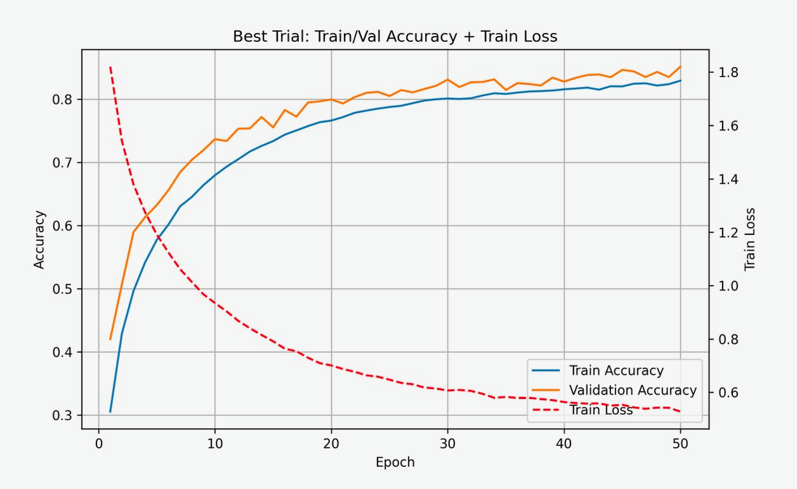
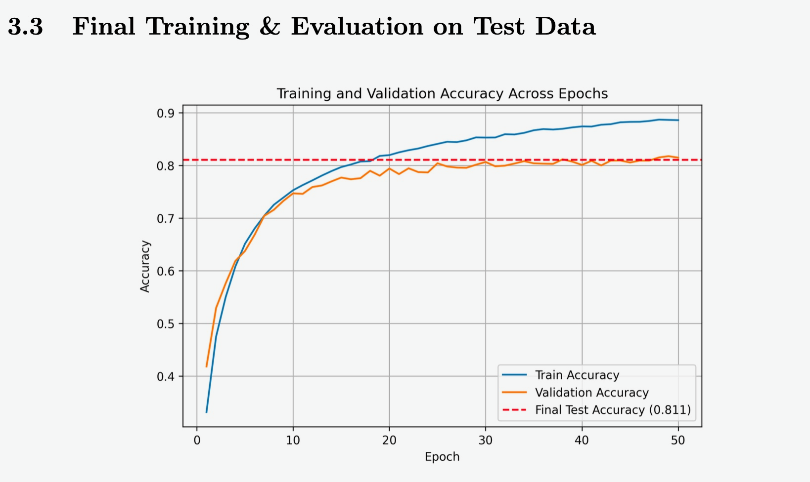

# CNN Architecture & Hyperparameter Optimization for CIFAR-10

> **Team Research Project — UCLA STATS 143: Research in Statistics**

This project investigates the design and optimization of **Convolutional Neural Networks (CNNs)** for CIFAR-10 image classification using **Neural Architecture Search (NAS)**, **Differentiable Architecture Search (DARTS)**, and **Bayesian Optimization**.

The study focuses on balancing predictive performance with computational efficiency under practical GPU resource constraints.

## Project Overview

The goal of this project was to systematically evaluate how neural network architecture and training hyperparameters affect image classification performance.

Architecture search and hyperparameter optimization were separated into two stages:

1. **Architecture Search** — NAS and DARTS were used to identify high-performing CNN structures.
2. **Hyperparameter Optimization** — Bayesian Optimization was used to refine training configurations after architecture selection.

## Dataset

The project uses the **CIFAR-10** image classification dataset, consisting of:

* 60,000 color images
* 10 object classes
* 50,000 training images
* 10,000 test images
* Image resolution of 32 × 32 pixels

The training data were further divided into **45,000 training samples** and **5,000 validation samples**, while the test set remained unseen during architecture selection and hyperparameter tuning.

## Methods

### Neural Architecture Search (NAS)

NAS was used to explore CNN architectures across:

* 2–5 convolutional layers
* 16, 32, and 64 filters
* 3 × 3 and 5 × 5 kernels
* ReLU and LeakyReLU activations
* Max and average pooling

A total of **50 architecture trials** were evaluated.

### Differentiable Architecture Search (DARTS)

DARTS was used as a gradient-based architecture search method to optimize candidate operations within the network.

The best DARTS architecture achieved approximately **85.1% validation accuracy**, outperforming the standard NAS search.

### Bayesian Optimization

Following architecture selection, Bayesian Optimization was applied to tune:

* Learning rate
* Weight decay
* Batch size
* Optimizer
* Momentum

This allowed the project to systematically evaluate training configurations without exhaustive grid search.

## Model Performance

The DARTS architecture demonstrated stable convergence, reaching validation accuracy of approximately **84–85%** during architecture search.

The final selected DARTS-based model achieved:

**81.1% test accuracy on the held-out CIFAR-10 test set.**

The test set was not used during architecture selection or hyperparameter optimization.

## Computational Resources

Architecture search is computationally intensive. The project received **400 GPU-hours** through ACCESS and Purdue Anvil AI resources.

The experiments also demonstrated a clear computational trade-off between NAS and DARTS: DARTS produced stronger validation performance but required substantially more training time per architecture trial.

## Key Findings

* DARTS identified higher-performing CNN architectures than standard NAS within the explored search space.
* Bayesian Optimization provided an efficient approach for tuning training hyperparameters.
* The final DARTS-based model achieved **81.1% test accuracy** on unseen CIFAR-10 data.
* Higher architecture-search performance came with increased computational cost, highlighting the trade-off between model accuracy and computational efficiency.

## Project Report

The complete methodology, experimental results, limitations, and analysis are available in:

**`CNN_Architecture_Optimization_Report.pdf`**

## Project Note

This repository serves as a **project showcase for a five-member team research project** completed for UCLA STATS 143.

The original training code is not included in this repository. Reproducing the full architecture-search experiments would also require substantial GPU resources.

## Tools & Methods

**Python** · **CNN** · **Deep Learning** · **CIFAR-10** · **Neural Architecture Search** · **DARTS** · **Bayesian Optimization** · **GPU Computing**

## Authors

Allison Lynn · Cynthia Du · Bryan Mui · Ryan So · **Mian Xie**
